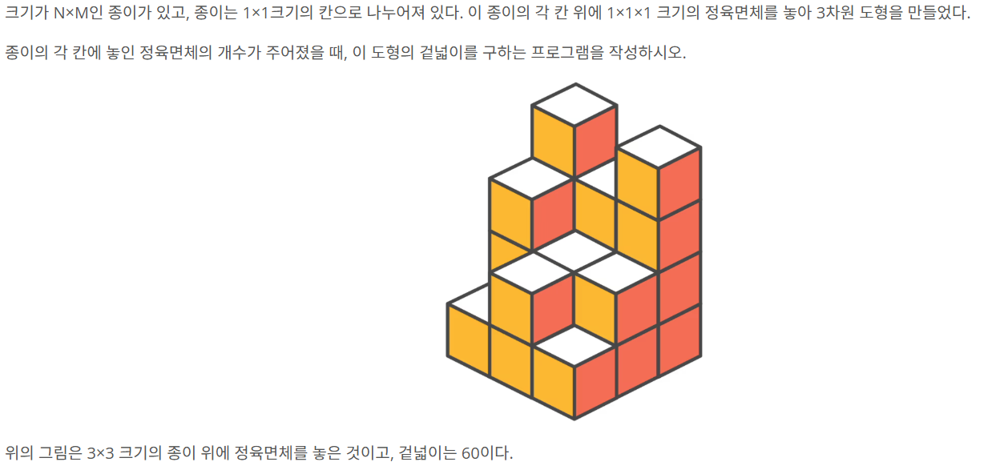
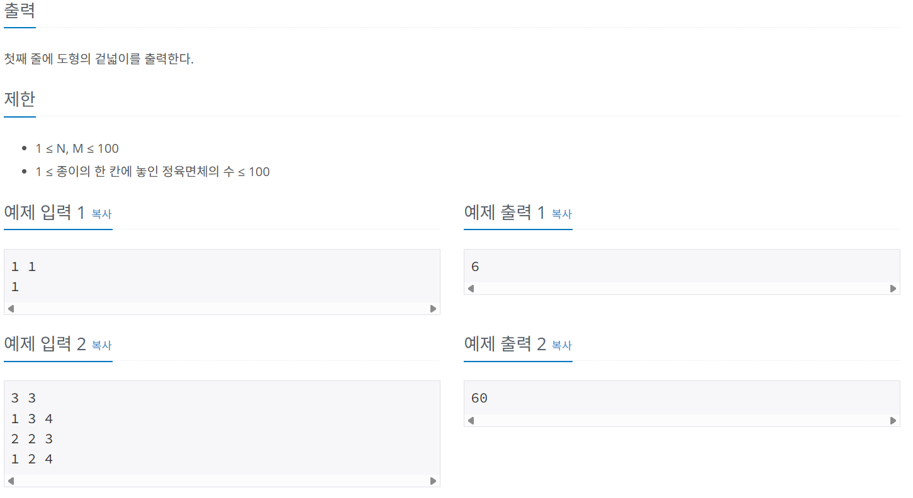
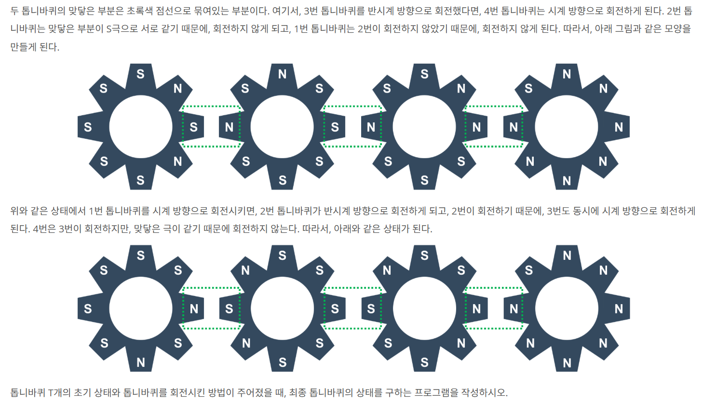
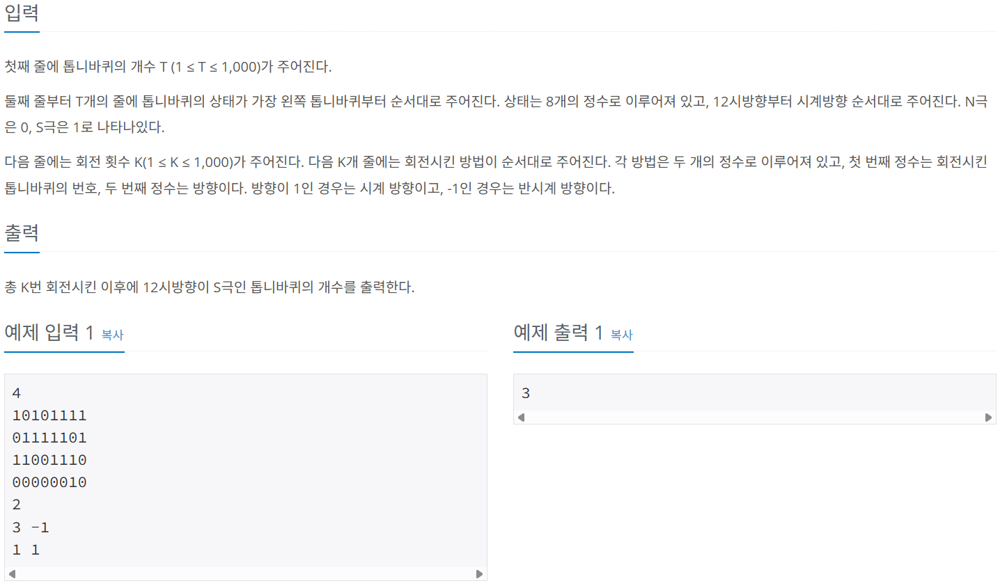
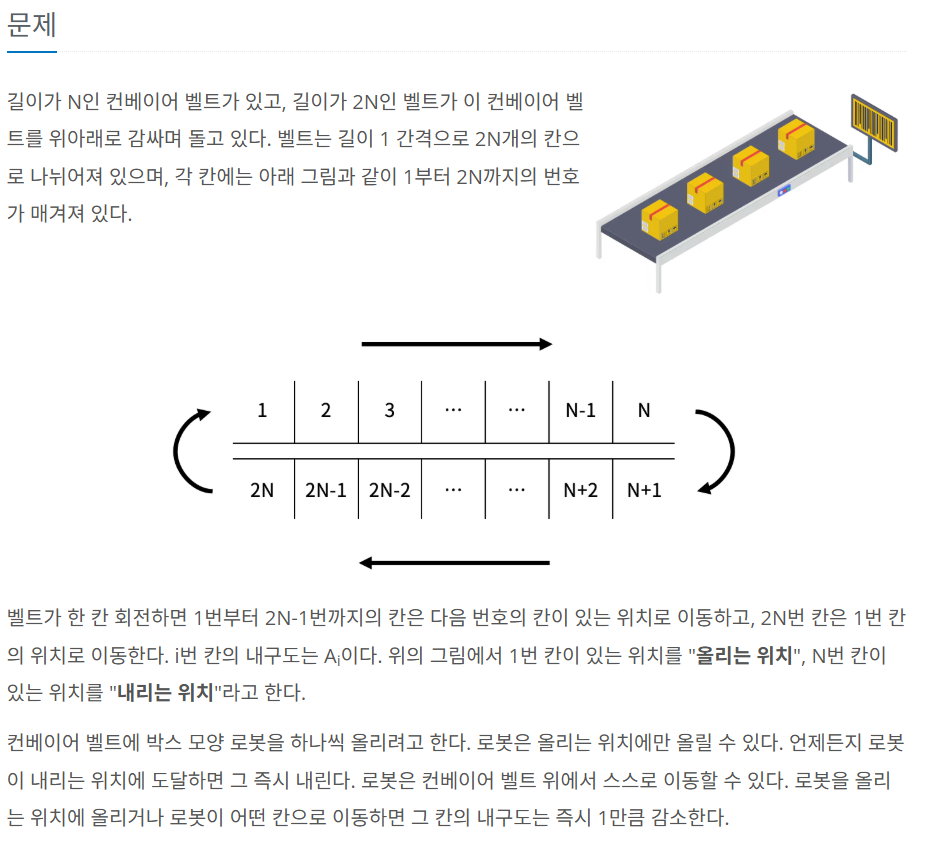
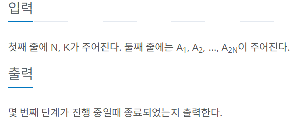

# 시뮬레이션 & 구현

# 16931. 겉넓이 구하기





- 겉넓이를 구하기 위해서는 입체도형의 up, down, front, back, left, right 에서 보이는 사각형들의 합을 구하면 된다
    - up, down = N * M
    - left, right = 1 ~ N 에서 맨 앞 블록 높이 + (j번째 블록높이 - (j-1)번째 블록높이) → 양수일때만
    - front, back = 1 ~ M 에서 맨 앞 블록 높이 + (i번째 블록높이 - (i-1)번째 블록높이) → 양수일때만
    - 주의: left와 front는 for문 순서가 동일하지 않음

```python
# 16931 겉넓이 구하기

N, M = map(int, input().split())
arr = [list(map(int, input().split())) for _ in range(N)]

up = N * M

left = 0
for i in range(N):
    for j in range(M):
        if j == 0:
            left += arr[i][j]
        else:
            if arr[i][j] > arr[i][j - 1]:
                left += arr[i][j] - arr[i][j - 1]

front = 0
for j in range(M):
    for i in range(N):
        if i == 0:
            front += arr[i][j]
        else:
            if arr[i][j] > arr[i - 1][j]:
                front += arr[i][j] - arr[i - 1][j]
                
answer = 2 * (up + left + front)
print(answer)
```

---

# 15662. **톱니바퀴 (2)**





### 1. 톱니바퀴 회전

`deque` 의 **`rotate()`** 함수를 이용하면 톱니바퀴의 회전을 쉽게 구현할 수 있다.

```python
from collections import deque

arr = deque([1,2,3,4,5])
arr.rotate(1) # arr = [5,1,2,3,4]

arr = deque([1,2,3,4,5])
arr.rotate(-1) # arr = [2,3,4,5,1]
```

`rotate()` 함수 인자로 양수를 사용하면 배열의 원소를 **오른쪽**으로 양수 값만큼 이동한다.

`rotate()` 함수 인자로 음수를 사용하면 배열의 원소를 **왼쪽**으로 음수 값만큼 이동한다.

즉, `rotate()` 함수 인자로 `1` 을 사용하면 시계 방향으로 한칸 이동하고, `-1` 을 사용하면 반시계 방향으로 한칸 이동하게 된다.

### 2. 풀이 조건

★중요★ 모든 톱니바퀴는 동시에 돌아간다. 

또한, 극이 다를 경우 옆 기어는 항상 바로 이전 기어와 반대 방향이므로 아래 조건을 활용할 수 있음. `(element-t) % 2` 

따라서,

- 회전 여부 판단 → 현재 상태 기준
- 실제 회전 → 나중에 한번에

```python
# 15662 톱니바퀴(2)

import sys
from collections import deque

input = sys.stdin.readline

# n = 0 , s = 1
# 1 = 시계 , -1= 반시계

T = int(input()) # 톱니바퀴의 개수
gears = [deque(map(int, input().strip())) for _ in range(T)]

K = int(input()) # 회전횟수
turn = [list(map(int, input().split())) for _ in range(K)]

def solution(T, gears, K, turn):

    for target, direction in turn:
        
        rotate_list = []

        # target 기어 우측 확인
        for i in range(target, T):
            if gears[i][6] != gears[i - 1][2]:
                rotate_list.append(i) # 회전해야할 기어 index 저장
            else:
                break
        
        # target 기어 좌측 확인
        for i in range(target - 2, -1, -1):
            if gears[i][2] != gears[i + 1][6]:
                rotate_list.append(i)
            else:
                break

        # target 기어 회전
        gears[target - 1].rotate(direction)

        # t 기어와 맞닿은 극이 다른 기어 회전
        for element in rotate_list:
            gears[element].rotate(-direction if (element - (target-1)) % 2 else direction) # target에서 몇 칸 떨어졌나? 홀수면 - 짝수면 +
    
    return sum(gear[0] for gear in gears)

        

result = solution(T, gears, K, turn)
print(result)

```

---

# 20055. 컨베이어 벨트 위의 로봇





### 풀이 팁

- 배열 내 0의 갯수 세기: dur.count(0)
- 로봇을 뒤에서부터 이동시켜야 중복 이동 방지 가능: i+1을 확인해야 해서 N-2부터 시작
- 회전 → 이동 → 올리기 순서 주의
- 내리는 로봇 제거해야함

```python
# 20055 컨베이어 벨트 위의 로봇

import sys
from collections import deque

input = sys.stdin.readline

N, K = map(int, input().split())
dur = deque(map(int, input().split()))
robots = deque([0] * N)

step = 0

while True:

    # 1. 컨베이어 벨트 회전
    dur.rotate(1)
    robots.rotate(1)
    robots[N-1] = 0 # 내리는 위치 로봇 제거

    # 2. 바로 옆 칸의 dur이 0이 아니라면 로봇들 이동
    for i in range(N-2, -1, -1):
        if robots[i] != 0 and robots[i + 1] == 0 and dur[i + 1] != 0:
            robots[i] = 0
            robots[i + 1] = 1
            dur[i + 1] -= 1
    robots[N-1] = 0 # 내리는 위치 로봇 제거

    # 3. 로봇 올리기
    if dur[0] != 0: # 내구도가 0이 아니라면 로봇 올리고 robots에 위치 저장
        robots[0] = 1
        dur[0] -= 1
    
    step += 1

    if dur.count(0) >= K:
        print(step)
        break
```
